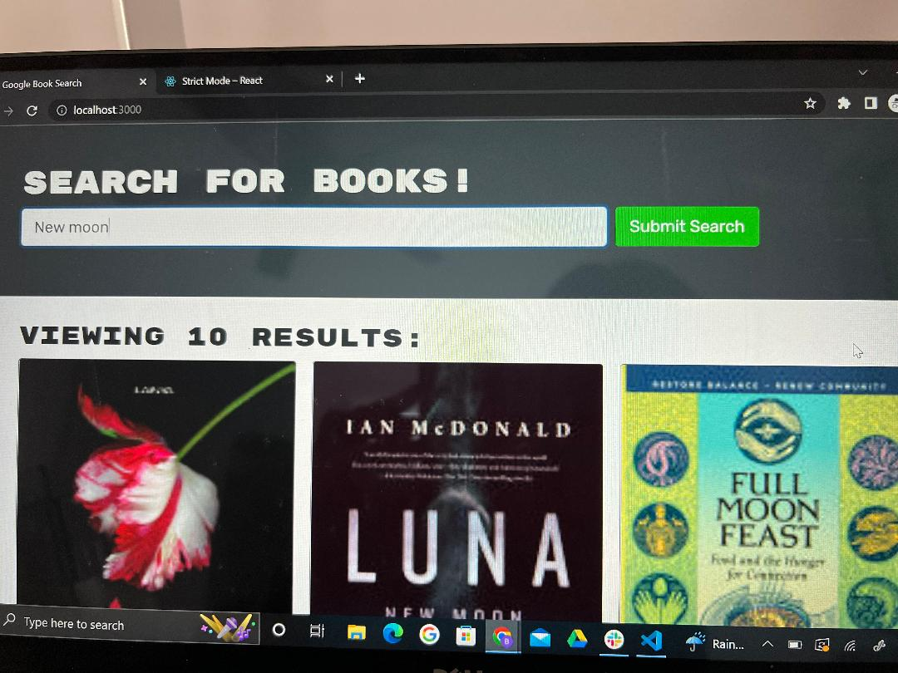
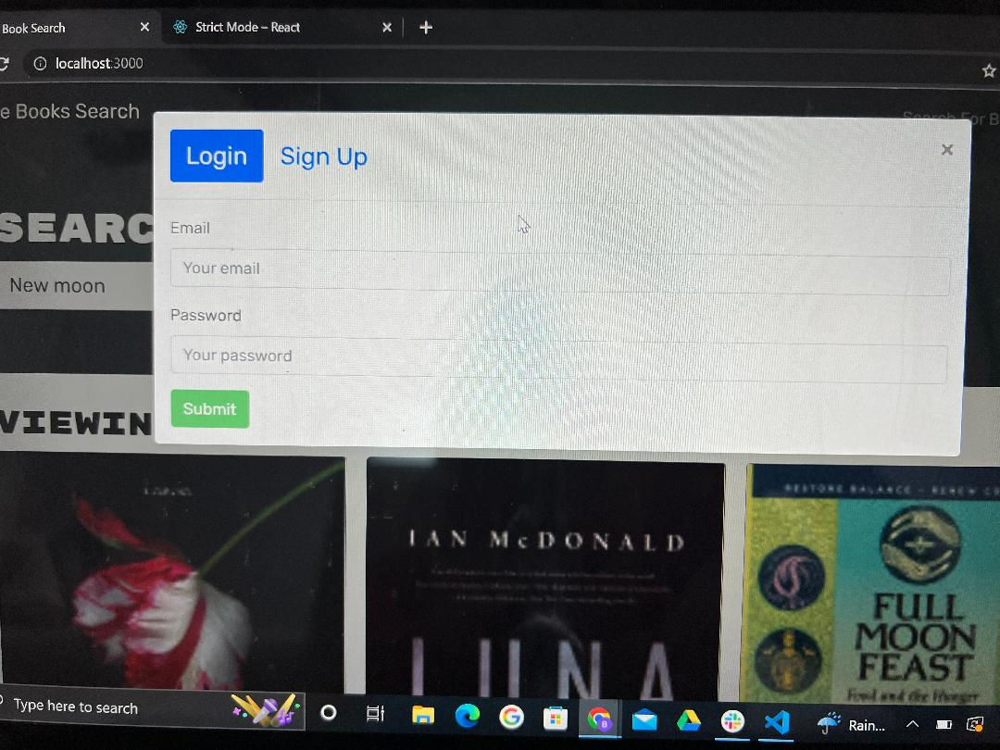

# MERN-Book-Search

  ## Description
  The MERN book search application is a perfect example of how to convert a platform from using node, express, and the typical route set up; to using an Appollo Server and GraphQL queries and mutations. The application works the same either way, but this repository allows coders to see the many differences on the front and back end. View the files in both the server and client folders. You will see some files have been fully commented out like the routes and controllers files in the server side. The files have been left to view the transition to graphql. Additionally in other files you'll see some code snippets commented out. Most of which are regarding imports from queries.js and mutations.js versus the RESTFUL API. Take a look for yourself and see what's there!

  ## Table of Contents

* [Installation](#installation)
* [Usage](#usage)
* [License](#license)
* [Contributing](#contributing)
* [Tests](#tests)
* [Questions](#questions)

## Installation
To install this application go through the following steps. 
1. Open or clone the repository to VSC. 
2. Run npm install so all dependencies are installed for application. 
3. View the main package.json and run the scripts
4. npm run build
5. npm run seed
6. npm run start!
7. When you start the server you can also make your way to graphql to test the queries yourself!

## Usage
With the book search engine application Users can login, signup, search up books by title, save books to their profile, view saved books and delete them, and of course logout! Feel free to test out the queries and mutations yourself on GraphQL! You can also view the following images and/or deployed link to check out the functional app!

 
 

Deployed: 

## License
This application uses the ISC license 

## Contributing
If you are looking to add a contribution to this project you can visit this site for information: [Contributor Covenant](https://www.contributor-covenant.org/)

## Tests
There are currently no tests to run on this application, but you can test the routes in insomnia. 

## Questions

For any additional questions or issues, you can reach out to me 
via email at brittany.klose@yahoo.com
Otheriwise fee free to further view my work on my github page at [britt-klose](https://github.com/britt-klose/).